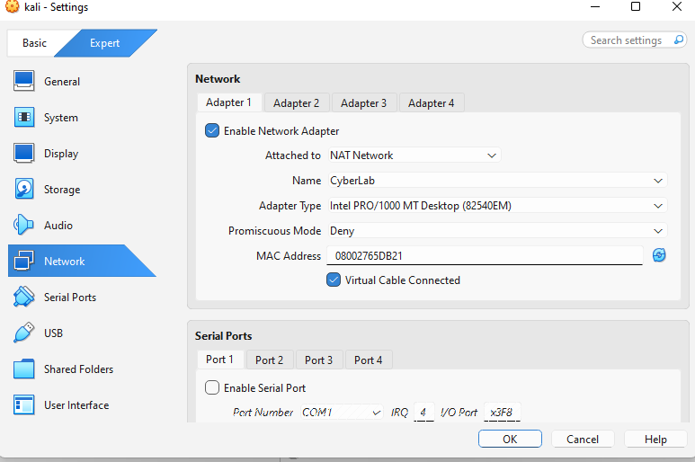
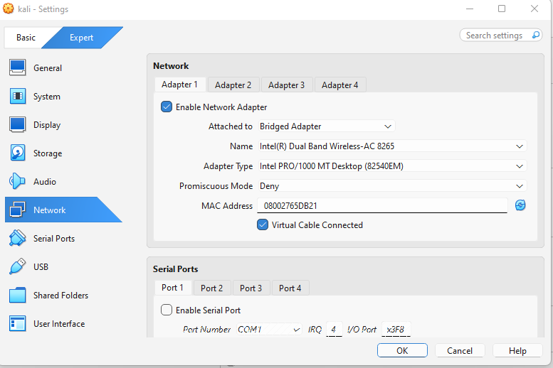
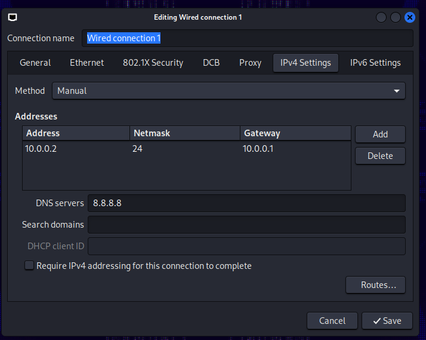
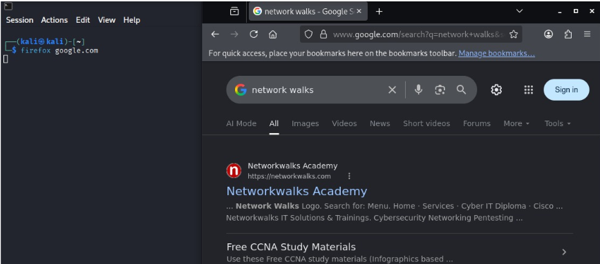

 🖥️ Cybersecurity Lab Environment Setup

A controlled and isolated cybersecurity lab environment built using Oracle VirtualBox and Kali Linux for ethical hacking, penetration testing, and network security practice.

 🎯 Lab Purpose

The purpose of this project is to create a safe virtual environment where cybersecurity concepts and penetration-testing techniques can be practiced without directly affecting the host computer or production networks.

The lab uses a dedicated NAT Network so that virtual machines can communicate with each other while remaining separated from the host network.

 🎯 Objectives

* Configure Oracle VirtualBox
* Set up Kali Linux
* Create a custom NAT Network
* Configure Kali Linux IPv4 networking
* Verify network connectivity
* Create a clean VM snapshot
* Document the complete lab setup
* Prepare the environment for future cybersecurity exercises

 🧩 Lab Environment

| Component               | Configuration     |
| ----------------------- | ----------------- |
| Virtualization Platform | Oracle VirtualBox |
| Operating System        | Kali Linux        |
| Network Mode            | NAT Network       |
| Network Name            | NatNetwork        |
| IPv4 Network            | `10.0.0.0/24`     |
| DHCP                    | Enabled           |
| Kali IP                 | `10.0.0.2`        |
| Netmask                 | `/24`             |
| Gateway                 | `10.0.0.1`        |
| DNS                     | `8.8.8.8`         |

 ## 🪜 Step-by-Step Setup

 Step 1: Install VirtualBox

Oracle VirtualBox was installed and configured as the virtualization platform for the cybersecurity lab.

## Step 2: Configure NAT Network

A custom NAT Network was created in VirtualBox.

Network Configuration:

Network: 10.0.0.0/24
Gateway: 10.0.0.1
DHCP: Enabled

The NAT Network allows multiple virtual machines to communicate with each other while providing controlled network access.

## Step 3: Configure Kali Linux

Kali Linux was imported into VirtualBox and its network adapter was connected to the custom NAT Network.

## Step 4: Configure IPv4

Kali Linux was configured with a static IPv4 address.

IP Address: 10.0.0.2
Netmask:    255.255.255.0
Gateway:    10.0.0.1
DNS:        8.8.8.8

 ## Step 5: Verify Network Connectivity

Network configuration was verified using Linux networking commands.

ip addr
ip route
nmcli device status

Connectivity was tested using:

ping -c 4 10.0.0.1
ping -c 4 8.8.8.8

### Step 6: Create a Snapshot

After successfully configuring and testing Kali Linux, a clean snapshot was created.

## 🐞 Problems Faced & Solutions

### NetworkManager Configuration Issue

During the network configuration process, the graphical NetworkManager interface did not work as expected.

The configuration was therefore performed using the Kali Linux command line and NetworkManager commands.

After applying the configuration, the network connection was tested successfully.

### Key Learning

This provided practical experience in troubleshooting Linux networking and configuring network settings through the command line.

## 💾 Snapshot Strategy

A clean snapshot was created after the initial configuration was verified.

Future snapshots can be created before major cybersecurity exercises.

Recommended approach:

1. Keep the original clean snapshot unchanged.
2. Create a new snapshot before major lab activities.
3. Give snapshots meaningful names.
4. Restore the clean snapshot if the VM becomes misconfigured.

## 📸 Screenshots

Below are the screenshots from the cybersecurity lab setup process.

### 1. NAT Network Configuration in VirtualBox

### 2. Kali Linux Network Adapter Settings

### 3. IPv4 Configuration in Kali Linux

### 4. VM Snapshot

## 💡 What I Learned

Through this lab, I learned:

* Basics of virtualization using VirtualBox
* Difference between NAT and NAT Network
* Virtual machine networking
* IPv4 configuration in Kali Linux
* NetworkManager troubleshooting
* Static IP configuration
* Network connectivity testing
* Importance of VM snapshots
* Documentation and reproducibility in cybersecurity labs

## 🔐 Security & Ethical Use

This laboratory environment is intended strictly for **authorized cybersecurity learning and testing**.

All penetration-testing activities should only be performed against systems that are personally owned or where explicit permission has been provided.

## 🛠️ Tools & Technologies

* Kali Linux
* Oracle VirtualBox
* Linux NetworkManager
* IPv4 Networking
* NAT Network
* Ping
* `ip`
* `nmcli`

## 👤 Author

**Hoor**

Cybersecurity Intern — Batch B082
Networkwalks Academy

**Mentor:** Waqas Karim (CCIE)

## 📌 Project Information

**Internship:** Cybersecurity Internship
**Week:** 01
**Project:** Cybersecurity Lab Environment Setup
**Organization:** Networkwalks Academy
